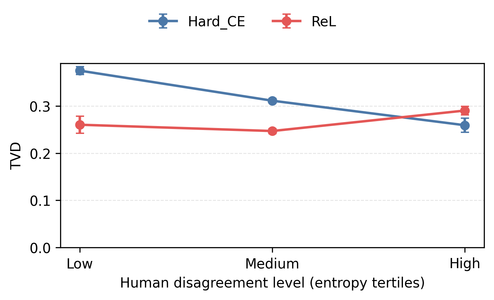
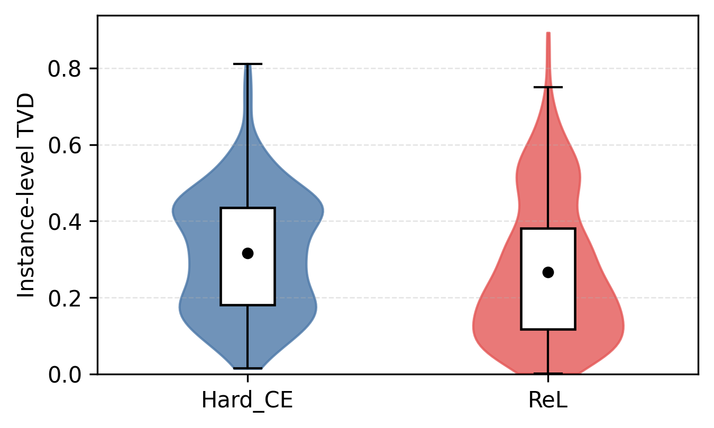

# spinda

> Simple Prediction and Interpretation of Data with Human Label Variation

spinda (Simple Prediction and Interpretation of Data with Human Label
Variation) is a toolkit for training, evaluating, and interpreting NLP models when
multiple humans label the same example. It works with hard labels, empirical
label distributions, multi-label tasks, and multi-dimensional annotations.

## Install

```bash
uv sync
```

Run commands from the repository root:

| Command | Purpose |
| --- | --- |
| `spinda download <source>` | Download a supported raw dataset. |
| `spinda train` | Fine-tune one or more seed runs. |
| `spinda predict` | Export predictions from a checkpoint. |
| `spinda evaluate` | Compute metrics and optional disagreement artifacts. |
| `spinda analyze` | Aggregate analysis artifacts across seed runs. |

## Start with ChaosNLI

[ChaosNLI](https://aclanthology.org/2020.emnlp-main.734/) is a three-way NLI task with many annotations per example. spinda keeps the original votes
rather than reducing them to one label. Its prepared layout is:

```text
data/datasets/text_pair/chaosnli/mnli_m/0/
├── dataset.json
├── train.json
├── dev.json
└── test.json
```

### Prepare the data

Download the raw release and convert the MNLI-M fold into spinda's dataset
format. The downloader tries the official ChaosNLI archive first and falls back
to a public research mirror containing the same original JSONL files when the
upstream Dropbox link is unavailable; use remains subject to ChaosNLI's original
license.

```bash
uv run spinda download chaosnli
uv run python -m hlv_toolkits.scripts.prepare_chaosnli_annotation_labels \
  --subsets mnli_m --fold 0
```

The manifest is JSON configuration: it declares the task format, split paths,
class order, and label mode:

```json
{
  "format": "text_pair_label_distribution",
  "label_mode": "soft",
  "train_path": "data/datasets/text_pair/chaosnli/mnli_m/0/train.json",
  "dev_path": "data/datasets/text_pair/chaosnli/mnli_m/0/dev.json",
  "labels": ["entailment", "neutral", "contradiction"]
}
```

A row contains the two texts and every annotator's label index. For example,
the following row represents two entailment votes, one neutral vote, and one
contradiction vote; the reader derives the human distribution `[0.50, 0.25,
0.25]` automatically.

```json
{
  "id": "example-1",
  "text_a": "The oil filter is within reach.",
  "text_b": "It is worth trying to remove the oil filter.",
  "annotation_labels": [0, 0, 1, 2]
}
```

To use your own dataset, see [the bring-your-own-data guide](data/README.md)
for the required format and training workflow.

### Train with reusable JSON configuration and CLI overrides

spinda does not assign fixed roles to configuration files. For example, you can
keep the stable data definition in `dataset.json`, share optimization defaults
in `configs/training.json`, and add a model- or experiment-specific JSON file
only when it is reusable. This lets the same dataset definition be reused
across models and experiments without copying it.

Files merge from left to right. Explicit CLI values then take precedence, which
is useful for a one-off ablation: the command below keeps the shared learning
rate from `configs/training.json` everywhere else, but tests `1e-5` for this
single run without editing or duplicating either JSON file.

```bash
uv run spinda train \
  --config data/datasets/text_pair/chaosnli/mnli_m/0/dataset.json configs/training.json \
  --model roberta-base \
  --learning_rate 1e-5 \
  --label_training_strategy rel \
  --seeds 42 \
  --output_dir outputs/chaosnli_example
```

`soft` trains against the empirical label distribution. Choose `ce`, `mse`,
`jsd`, or `rel` as the training objective; `rel` uses the individual annotation
votes as repeated hard-label observations. The full option reference and
configuration precedence are in
[docs/configuration_reference.md](docs/configuration_reference.md).

## Evaluate and analyze a run

### A spinda-trained model

For a checkpoint trained above, prediction and evaluation connect directly:
`predict` writes the JSON file that `evaluate` accepts, with no conversion. See the [prediction options](docs/configuration_reference.md#prediction).

```bash
uv run spinda predict \
  --model_path outputs/chaosnli_example/seed_42/final_model \
  --input_file data/datasets/text_pair/chaosnli/mnli_m/0/test.json \
  --output_file outputs/chaosnli_example/seed_42/test/predictions.json

uv run spinda evaluate \
  --predictions outputs/chaosnli_example/seed_42/test/predictions.json \
  --input_file data/datasets/text_pair/chaosnli/mnli_m/0/test.json \
  --human_labels data/datasets/text_pair/chaosnli/mnli_m/0/test.json \
  --metrics tvd kl entropy_correlation \
  --output_file outputs/chaosnli_example/seed_42/test/evaluation.json
```

Not sure which metrics to pass? Start with the label structure:

- **One hard label per example:** use `accuracy` or `macro_f1`; use macro-F1 when each class should contribute equally despite imbalance.
- **Categorical human-label distributions:** use `tvd` for distributional discrepancy. The paper's compact reporting set adds `kl` and `entropy_correlation`; the [metric relationships](docs/evaluation_metrics.md#spearman-correlation-in-the-paper) page explains that choice and its correlation evidence.
- **Independent multilabel probabilities:** use `macro_f1` for the hard-label result. For the paper's soft-label reporting set, add `soft_macro_f1`, `multilabel_pojsd`, and `multilabel_entropy_correlation`.
- **Several annotation dimensions:** choose the categorical metrics per dimension; `evaluate` also reports their unweighted overall mean.

The [evaluation metrics guide](docs/evaluation_metrics.md) defines every metric, its required inputs, and its direction; use the [metrics notebook](notebooks/metrics_tutorial.ipynb) to compare them on small controlled inputs. The [evaluation options](docs/configuration_reference.md#evaluation) list the accepted `--metrics` names and evaluation artifacts.

### An external model

The evaluation and analysis commands also work independently of spinda
training. Convert an external model's output to the [prediction JSON
contract](docs/prediction_contract.md#prediction-json): a `.json` top-level
array whose records have a matching `id`, a probability vector in the dataset's class order, and a zero-based predicted class:

```json
[
  {"id":"example-0001","outputs":{"probs":[0.10,0.75,0.15],"pred":1}}
]
```

For multilabel tasks, use the same outer record structure; `outputs.probs` and
`outputs.pred` are same-length vectors in label order, with zero-or-one values
in `pred`. See the [multilabel prediction JSON contract](docs/prediction_contract.md#multilabel-prediction-json).

Then run the same evaluator without loading any spinda checkpoint:

```bash
uv run spinda evaluate \
  --predictions external_predictions.json \
  --input_file external_input.json \
  --human_labels external_human_labels.json \
  --output_file outputs/external_model/evaluation.json
```

For [external human labels](docs/prediction_contract.md#evaluate-predictions)
or [multidimensional outputs](docs/prediction_contract.md#multidimensional-prediction-json),
use the corresponding prediction-contract variant.

For three-class soft-label data, `evaluate` can also write a static ternary PNG
and an interactive HTML diagnostic with per-instance hover details. It is
opt-in: pass `--ternary-plot` to write it, or use `--no-ternary-browser` to write only
the PNG.

## Analyze across seed runs

Add `--analysis` to an `evaluate` command only when you need
disagreement-stratified metrics and a per-instance error table. It writes
`evaluation__analysis.json` and `evaluation__analysis__instance_errors.csv`
beside the evaluation output. `spinda analyze` pools those artifacts and writes
a disagreement-stratified plot and an instance-level violin plot for the selected metric.

### Discover artifacts from run directories

Pass one strategy root per method with `--run-dirs`. SPInDa discovers each
`seed_*/test/evaluation__analysis.json` file and its paired CSV automatically.
Use `--labels` for display names; otherwise the directory names are used.

```bash
uv run spinda analyze --run-dirs \
  outputs/chaosnli/mnli_m/fold_0/roberta-base__soft_to_hard__ce \
  outputs/chaosnli/mnli_m/fold_0/roberta-base__soft__rel \
  --labels Hard_CE ReL \
  --metric tvd \
  --plots stratified \
  --output-dir outputs/disagreement_analysis
```

### Supply artifact files explicitly

Use `--analysis-files` when the reports are not arranged beneath strategy roots.
For an instance plot, pass one matching `--instance-errors-files` CSV and one `--labels` value for every analysis JSON. A stratified-only plot needs only the JSON reports.

```bash
uv run spinda analyze \
  --analysis-files outputs/hard/evaluation__analysis.json outputs/rel/evaluation__analysis.json \
  --instance-errors-files outputs/hard/evaluation__analysis__instance_errors.csv outputs/rel/evaluation__analysis__instance_errors.csv \
  --labels Hard_CE ReL \
  --metric kl \
  --plots instance \
  --output-dir outputs/disagreement_analysis
```

Select `--metric` from `tvd`, `jsd`, `kl`, `ce`, and `l2`. Use `--plots
stratified` or `--plots instance` to write only one figure type; omit `--plots`
to write both. The instance plot requires its paired CSV, while the stratified
plot needs only the analysis JSON. Use `--level LEVEL` for one dimension of a
multidimensional analysis, `--title` to set the plot title, and `--output-dir`
to choose where PNG and PDF files are written. All supplied artifacts must use
the same disagreement grouping. See the [analysis options](docs/configuration_reference.md#analysis)
for the full reference.

When both plot types are selected with the default `--metric tvd`, the outputs look as follows:

| Disagreement-stratified TVD | Instance-level TVD |
| --- | --- |
|  |  |

## Learn more

- [Data layout and public dataset format](data/README.md)
- [Configuration reference](docs/configuration_reference.md)
- [Prediction JSON contract](docs/prediction_contract.md)
- [Evaluation metrics](docs/evaluation_metrics.md)

spinda supports text-pair and single-text classification, multi-label data, and
multi-dimensional annotations. The repository's canonical launchers for
ChaosNLI, DiscoGeM, MD-Agreement, MultiPICo, TGeGUM/Humans-and-Domains, and
MFRC are listed in the paper guide below.

## Reproduce the paper

[docs/reproducing_paper.md](docs/reproducing_paper.md) documents the supported
paper launchers, default multi-seed settings, and dataset-specific experiment
scope. It is intentionally separate from the general workflow above.

## License

spinda is released under the [MIT License](LICENSE).
