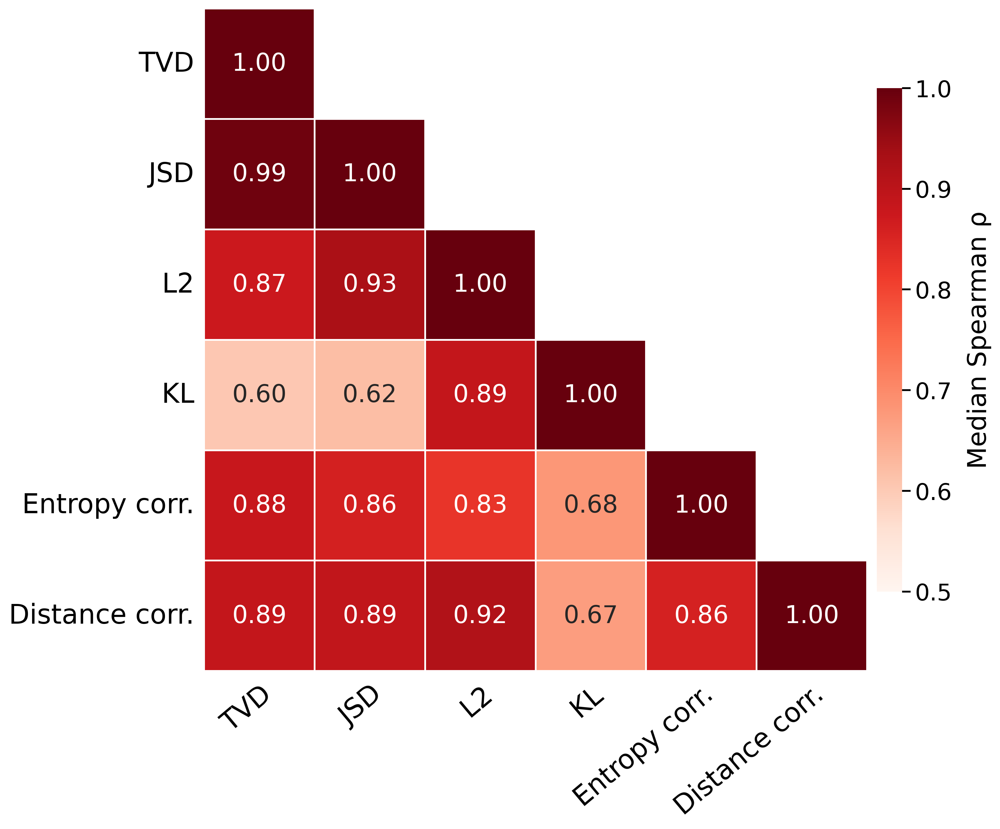

# Choosing Evaluation Metrics

This guide helps you choose the metrics to report from `spinda evaluate`.
Choose metrics based on the label target, not on which score makes a model look
best. Use one primary metric for model selection, then add only metrics that
answer a distinct question.

## Recommended reporting sets

| Task and available target | Primary metric | Add when it answers a separate question |
| --- | --- | --- |
| One hard class per example | Accuracy; macro-F1 when classes are imbalanced | Per-class F1 or a confusion matrix |
| Categorical human distribution | Mean TVD | KL and entropy correlation |
| Independent multi-label probabilities | Macro-F1 | Soft macro-F1, multilabel PO-JSD, and entropy correlation |
| Multi-dimensional annotation | The applicable primary metric for each level | Unweighted mean across levels, plus per-level results |

For a paper or experiment table, a sensible default is one primary metric and
one or two complements. Keep the metric directions explicit: lower is better
for TVD, JSD, KL, cross-entropy, and L2; higher is better for accuracy,
soft F1, PO-JSD, and the correlation metrics.

## Hard-label classification

When each example has a single adjudicated class, evaluate the predicted class.
Use accuracy for balanced, single-label classification. Prefer macro-F1 when
rare classes matter as much as frequent ones, and include per-class F1 when a
summary score could conceal a weak class.

Hard-label metrics do not evaluate whether predicted probabilities match human
disagreement. When individual annotations are available, retain them and use
the categorical-distribution metrics below as the main HLV evaluation.

## Categorical human label distributions

For mutually exclusive labels, `spinda` compares the model probability vector
with the empirical distribution of human votes for every example.

### Primary metric: TVD

Use mean total variation distance (TVD, also called DistCE in this setting) as
the default primary metric. It has a direct interpretation: the amount of
probability mass that must move to transform the model distribution into the
human distribution. It ranges from 0 to 1, and lower is better.

### Complementary metrics

- Use `kl` as the paper's complementary error metric; it penalizes assigning
  very little probability to a human-supported label.
- `distance_correlation` and `ce` remain available for targeted analyses, but
  they are not part of the paper's compact categorical reporting set.
- Use `entropy_correlation` when the question is whether model uncertainty
  rises and falls with human disagreement across examples.
- Keep `accuracy` as an argmax baseline, not the sole HLV result.

### Avoid duplicate co-primary metrics

TVD and JSD answer nearly the same ranking question in the categorical
experiments included with this repository. Their median Spearman
correlation is approximately 0.98 in the paper's analysis. For paper-aligned
reporting, use TVD and reserve JSD for comparisons that explicitly require it.

The full definitions and toy examples are in the
[HLV metric tutorial](hlv_metrics_tutorial.md).

## Multi-label probability targets

For independent labels, probabilities do not need to sum to one. The choices
therefore differ from a categorical simplex.

### Paper reporting set: macro-F1, soft macro-F1, PO-JSD, and entropy correlation

The paper uses macro-F1 as the conventional task metric, then reports soft
macro-F1, multilabel PO-JSD, and multilabel entropy correlation as HLV-aware
metrics. Macro-F1 gives every label equal weight; soft macro-F1 measures soft
overlap; PO-JSD compares label-wise Bernoulli distributions; and entropy
correlation measures uncertainty alignment.

Soft micro-F1 remains available and is the default development-selection metric
in the current configuration. It is not the paper's primary reported metric:
it is strongly correlated with soft macro-F1 (Spearman rho = 0.895), so the
paper uses soft macro-F1 in the compact reporting set.

## Correlation evidence

For categorical HLV settings, the paper computes correlations within each
dataset-language setting across model-strategy configurations after averaging
over random seeds, then aggregates them by the median across datasets.
Spearman correlation is the paper's primary analysis; Pearson correlation is
shown as a complementary value-scale check. These figures motivate compact
reporting sets rather than a universal metric ranking.

| Pearson r | Spearman rho |
| --- | --- |
|  |  |

TVD, JSD, L2, and distance correlation are strongly correlated in the paper's
categorical analysis. KL divergence and entropy correlation are less strongly
correlated with the other measures, which is why the paper reports TVD as the
representative discrepancy metric and retains KL plus entropy correlation as
complements.

For multi-label MFRC, soft micro-F1 and soft macro-F1 are strongly correlated
(Spearman `rho = 0.895`), while the remaining relationships are lower. This
motivates the paper's use of soft macro-F1 alongside PO-JSD and entropy
correlation.

## Multi-dimensional annotations

For data with several annotation levels or dimensions, evaluate every level
with the metric appropriate to its target type. Report the per-level values and
the unweighted mean emitted by the evaluator. Do not pool labels across levels:
it can hide a model that performs well on an easy dimension but poorly on a
harder one.

## Practical workflow

1. Decide what a better model means before training: correct argmax labels,
   faithful human distributions, rare-label coverage, calibrated uncertainty,
   or a combination.
2. Select one primary metric that directly measures that goal on the validation
   set.
3. Run `spinda evaluate` on the held-out set and report the same primary metric,
   plus only complementary metrics that answer a different question.
4. For categorical HLV data, add `--analysis` to inspect errors by human
   disagreement level instead of relying only on a dataset average.

For the evaluator input contract and its complete output schema, see the
[prediction JSON contract](prediction_contract.md). Configuration options for
development-model selection are listed in the
[configuration reference](configuration_reference.md).
