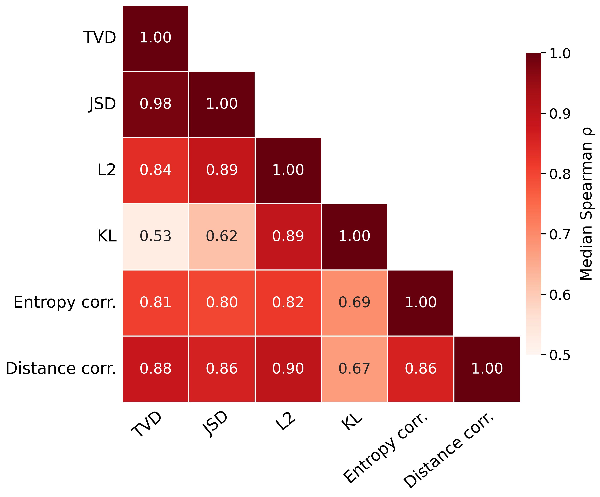
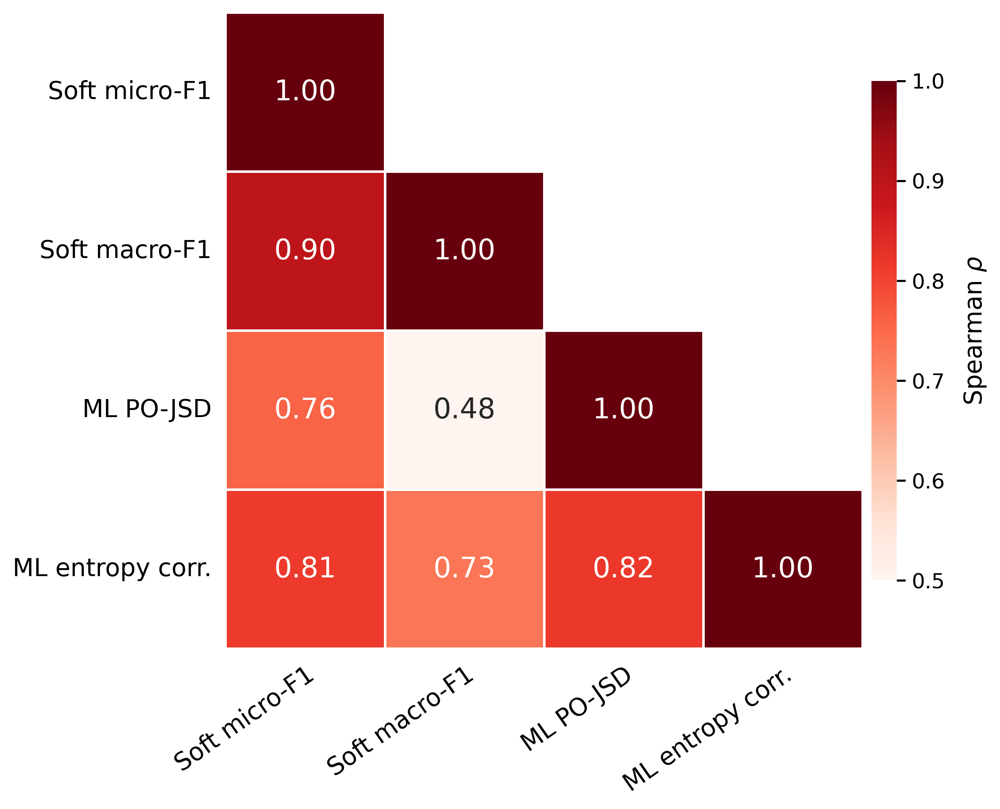

# Evaluation metrics

This page maps evaluator metric names to their implemented quantities, records exact metric relationships, and summarizes the metric correlations reported in the paper. The paper-specific reporting sets below are evidence from those experiments, not a general ranking of metrics. For executable examples, see the [metrics notebook](../notebooks/metrics_tutorial.ipynb).

## Categorical distributions

For categorical distribution metrics, model and human inputs are matrices with shape `[examples, classes]`; every row is non-negative and sums to one. The evaluator reports means for per-example quantities.

| Evaluator key | Implemented quantity | Reported direction |
|---|---|---|
| `accuracy` | Mean equality of predicted and majority-vote class indices | Higher |
| `tvd` | Mean `0.5 * sum(abs(p - q))` per example | Lower |
| `l1` | `2 * mean(tvd)` | Lower |
| `jsd` | Mean Jensen--Shannon divergence with base-2 logarithms | Lower |
| `pojsd` | Mean `1 - jsd` | Higher |
| `kl` | Mean `KL(human || model)` | Lower |
| `ce` | Mean cross-entropy `H(human, model)` | Lower |
| `l2` | Mean Euclidean distance per example | Lower |
| `soft_micro_f1` | Soft overlap over all examples and classes | Higher |
| `soft_accuracy` | The same categorical value as `soft_micro_f1` | Higher |
| `soft_macro_f1` | Mean soft overlap after computing one value per class | Higher |
| `entropy_correlation` | Pearson correlation of per-example model and human entropy | Higher |
| `distance_correlation` | Distance correlation of the two probability matrices | Higher |

## Independent multilabel probabilities

For multilabel metrics, model and human inputs have shape `[examples, labels]` with values in `[0, 1]`; rows do not need to sum to one.

| Evaluator key | Implemented quantity | Reported direction |
|---|---|---|
| `accuracy` | Exact match of binary label vectors | Higher |
| `micro_f1`, `macro_f1` | Hard-label F1 scores | Higher |
| `soft_micro_f1`, `soft_macro_f1` | Soft overlap scores | Higher |
| `multilabel_pojsd` | Mean PO-JSD after converting every label probability to a Bernoulli distribution | Higher |
| `multilabel_entropy_correlation` | Mean of per-label Pearson correlations of Bernoulli entropy | Higher |

## Multidimensional predictions

For multidimensional predictions, the evaluator applies categorical evaluation to every named dimension. The result contains a metric object for each dimension and an `overall` object whose values are the arithmetic mean across dimensions.

## Exact relationships for categorical distributions

Let `p` and `q` be categorical probability vectors. The following identities
are used by the implementation.

| Values | Relationship | Conditions |
|---|---|---|
| L1 and TVD | `L1(p, q) = 2 * TVD(p, q)` | Categorical probability vectors. |
| Soft accuracy and TVD | `soft_accuracy(p, q) = 1 - TVD(p, q)` | Categorical probability vectors. |
| Cross-entropy and KL | `CE(q, p) = H(q) + KL(q || p)` | The same human distribution `q` and model distribution `p`. |
| PO-JSD and JSD | `PO-JSD(p, q) = 1 - JSD(p, q)` | JSD computed with base-2 logarithms. |
| Soft micro-F1 and TVD | `soft_micro_f1(p, q) = 1 - TVD(p, q)` | Categorical rows normalized to sum to one. |

The identities above do not apply unchanged to independent multilabel
probabilities, which are evaluated without a row-sum constraint.

## Spearman correlation in the paper

### Categorical

The paper reports that TVD, JSD, L2, and distance correlation are strongly
correlated, while KL divergence and entropy correlation have weaker
relationships with the other reported measures. For the compact paper
reporting set, use TVD as the representative distributional discrepancy and
report KL and entropy correlation as complements; do not treat TVD and JSD as
co-primary results.

### Multilabel MFRC

The paper reports a Spearman correlation of `rho = 0.895` between soft
micro-F1 and soft macro-F1. For the compact paper reporting set, use macro-F1
with soft macro-F1, multilabel PO-JSD, and multilabel entropy correlation; soft
micro-F1 remains available for development selection but is not a co-primary
reported result.

## Related material

- [Metrics notebook](../notebooks/metrics_tutorial.ipynb): calculations on controlled arrays and ternary visualizations.
- [Configuration reference](configuration_reference.md): evaluator options and accepted `--metrics` names.
